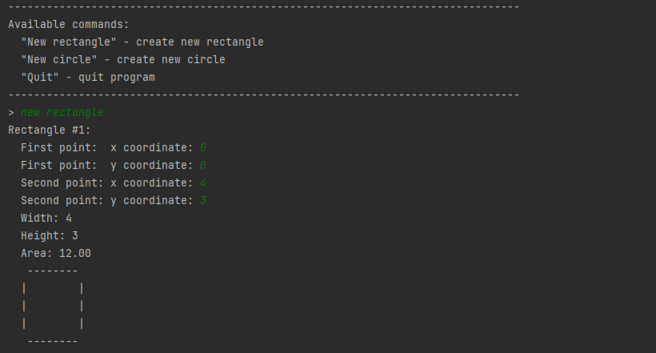
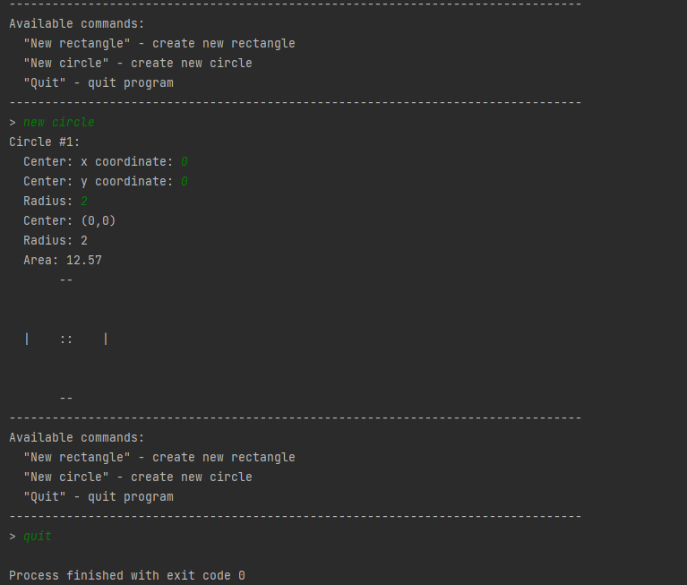

# Geometric Shapes #
## Description ##
Program either draws rectangle or circle with sepcific size in consol.

## HOW TO USE ## 
To draw rectangle: type "New rectangle" in console and hit enter
then enter coordinates of bottom left and top right point of rectangle in the console
rectangle with specific size will then be drawn

To draw circle: type "New circle" in consol
enter coordinates and radius of circle in console
circle will then be drawn

To quit: enter quit in menu

# Screenshots of output #

